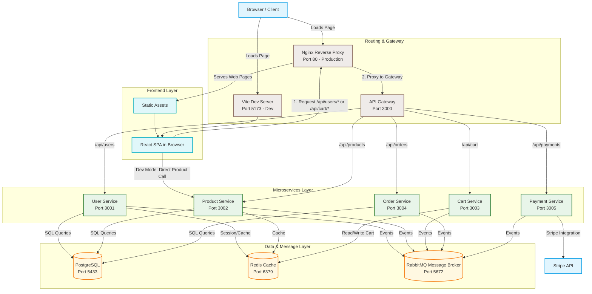

# Ecommerce Microservices App 🛍️

A minimalist clothing ecommerce web application built using a modern decoupled microservices architecture. The application supports user authentication (including secure admin account creation), a dynamic product catalog, real-time cart caching, and a responsive frontend user interface.

---

## 🏗️ System Architecture & Control Flow

The application is structured as a collection of containerized microservices that communicate over HTTP APIs (via an Express API Gateway) and connect to dedicated databases and services. 

### Control Flow Diagram



### Flow Breakdown
1. **Frontend Loading**: 
   * **Development**: The client connects to the Vite Dev Server (port `5173`).
   * **Production**: The client connects to Nginx (port `80`), which serves the compiled React static assets.
2. **Routing / Gateway**:
   * API requests starting with `/api` are routed to the **API Gateway** (port `3000`).
   * In development, this is proxied by Vite (`vite.config.js`). In production, this is routed by Nginx (`nginx.conf`).
3. **Gateway Routing**:
   * The API Gateway acts as a reverse proxy, parsing incoming paths and routing them to internal microservices based on route prefixes.
4. **Data Persistence & Cache**:
   * Microservices read/write data from their designated databases (`user_db`, `product_db`, `order_db` inside PostgreSQL).
   * **Cart Service** leverages **Redis** to quickly write and retrieve current session cart items.

---

## 🛠️ Tech Stack & Service Breakdown

| Service / Component | Port | Technology Stack | Description |
| :--- | :--- | :--- | :--- |
| **Frontend** | `80` (Prod) / `5173` (Dev) | React (Vite), CSS Variables, Nginx | Responsive clothing storefront, user profiles, admin product dashboard. |
| **API Gateway** | `3000` | Node.js, Express, `http-proxy-middleware` | Single entrypoint for all API clients. Proxies to services conditionally. |
| **User Service** | `3001` | Node.js, Express, Prisma, JWT, Bcrypt | Handles registration, authentication, JWT tokens in cookies, user profiles. |
| **Product Service** | `3002` | Node.js, Express, Prisma, Multer | Manages product catalog, image upload, database seeding. |
| **Cart Service** | `3003` | Node.js, Express, Redis Client | Manages shopper carts in Redis key-value storage. |
| **Order Service** | `3004` (Skeleton) | Node.js, Express, Prisma, RabbitMQ | Standard health checks. Setup to run order management schemas. |
| **Payment Service**| `3005` (Skeleton) | Node.js, Express, Stripe, RabbitMQ | Standard health checks. Setup to run Stripe payment processes. |

---

## 📁 Directory Structure

```bash
├── frontend/                     # React Single Page Application (Vite)
│   ├── src/
│   │   ├── assets/               # Fonts, local imagery
│   │   ├── components/           # Navbar, shared layout widgets
│   │   ├── pages/                # Auth, Profile, Cart, Catalog, Admin Dashboards
│   │   ├── App.jsx               # Client routes & central state managers
│   │   └── index.css             # Unified CSS Design Tokens & classes
│   ├── Dockerfile
│   └── nginx.conf                # Nginx production configuration
│
├── services/                     # Backend Microservices
│   ├── gateway/                  # Express Gateway / Routing Middleware
│   ├── user_service/             # Authentication & profile service (Prisma + PostgreSQL)
│   ├── product_service/          # Catalog & image upload service (Prisma + PostgreSQL)
│   ├── cart_service/             # Shopping cart cache service (Redis)
│   ├── order_service/            # Order service (Prisma + PostgreSQL) [Skeleton]
│   └── payment_service/          # Payment service (Stripe + RabbitMQ) [Skeleton]
│
├── docker-compose.prod.yml       # Production Docker orchestration
├── init-db.sql                   # SQL script initializing PostgreSQL DBs
├── replace-url.js                # Build script updating dev localhost API urls
└── package.json                  # Root npm workspace configuration
```

---


## 🚀 Running the Project

Ensure you have [Node.js (v20+)](https://nodejs.org/), [Docker Desktop](https://www.docker.com/products/docker-desktop/), and `npm` installed.

### 1. Local Development (Running Bare Metal)

First, install dependencies for the entire project workspace from the root:
```bash
npm install
```

#### Step A: Run Infrastructure Services
Start the required databases and cache layers using Docker Compose:
```bash
docker-compose -f docker-compose.prod.yml up -d postgres redis rabbitmq
```

#### Step B: Sync Prisma Database Schemas
Navigate to each service containing databases and push the prisma schemas:
```bash
# Push User Schema
cd services/user_service
npx prisma db push

# Push Product Schema
cd ../product_service
npx prisma db push

# Push Order Schema
cd ../order_service
npx prisma db push
```

#### Step C: Run Services Concurrently
Go back to the root folder. Start all services and the gateway:
```bash
npm run dev:services
```

#### Step D: Run the Frontend
In a new terminal window at the root:
```bash
npm run dev:frontend
```
Open `http://localhost:5173` in your browser.

---

### 2. Production Deployment (Running Entirely in Docker)

To run the frontend, gateway, microservices, database, and cache in a production-ready containerized environment:

From the root directory, build and run the containers:
```bash
docker-compose -f docker-compose.prod.yml up --build -d
```

Nginx serves the frontend on **port `80`**. Open your browser and navigate to `http://localhost`.

---

## 🔌 API Endpoints Summary

### User Service (`/api/users`)
* `POST /signup` - Normal user signup (role defaults to `USER`).
* `POST /admin-signup` - Secure admin signup (requires verification against `ADMIN_SECRET`).
* `POST /login` - Login authentication (stores JWT token inside HttpOnly cookies).
* `GET /me` - Fetches the authenticated user profiles.
* `PUT /profile` - Updates authenticated user's name or email.
* `POST /logout` - Clears the session cookie.

### Product Service (`/api/products`)
* `GET /api/products` - Returns list of all products in the database.
* `POST /api/products` - Creates new products *(Admin only)*.
* `PUT /api/products/:id` - Updates specific product details by ID *(Admin only)*.
* `DELETE /api/products/:id` - Deletes product from the catalog by ID *(Admin only)*.
* `POST /api/products/upload` - Uploads static product images to the disk using Multer *(Admin only)*.

### Cart Service (`/api/cart`)
* `GET /` - Fetches items cached in Redis for the currently logged-in user.
* `POST /add` - Adds a product item or increases its quantity in the cache.
* `DELETE /:productId` - Removes a single product item from the user's cart.
* `DELETE /` - Clears the user's shopping cart completely.
